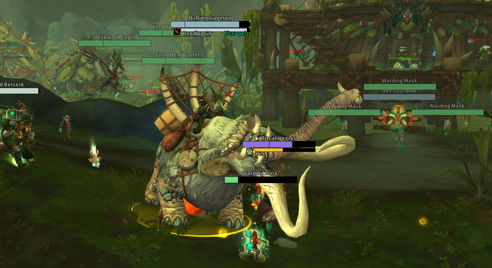
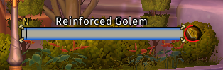

# Slab

Slab is a slim and colorful nameplate addon for Retail World of Warcraft with a focus on being clear, simple & efficient. It uses color to distinguish different classes of enemies, with high-visibility colors for dangerous threat states.

**Status:** Rewritten for Midnight. New & returning features are trickling in.

### Features

- Built-in support for threat and tank pets.
- Built-in cast bars with support for cast targets.
- Focus target indicator showing the cooldown of your interrupt (if talented)
- Option-free. Install & go, no fiddling allowed.

### Enemy Classes

- Boss: A Dungeon or Raid boss (or world boss, in open world content)
- Lieutenant: Traditionally a level 71 enemy in a dungeon or 72 in raid. These are usually immune to CCs and have important mechanics.
- Caster: Caster enemies are conventionally marked as "Paladin" NPCs in-game.
- Normal: Most enemies you encounter fall into the "normal" category.
- Trivial: "Spam" enemies like lashers on Gnarlroot and low-level enemies in Dungeons.

### A Note on Nameplate CVars

Many aspects of nameplates in WoW are controlled by CVars, which are stored as part of your game configuration independently of any addon. If you've used Plater or other nameplate addons, you likely have a large number of CVars set from adjusting nameplate settings through the their options.

Slab sets the following CVars:

- `nameplateMinScale`
- `nameplateSelectedScale`

## Efficient

Slab was written with efficiency in mind. Any frame drops in-game are dealt with ruthlessly---I will cut features if it means maintaining a seemless high framerate in-game.

# License

Copyright 2022-2026 emallson. Published under the BSD 3-Clause.
