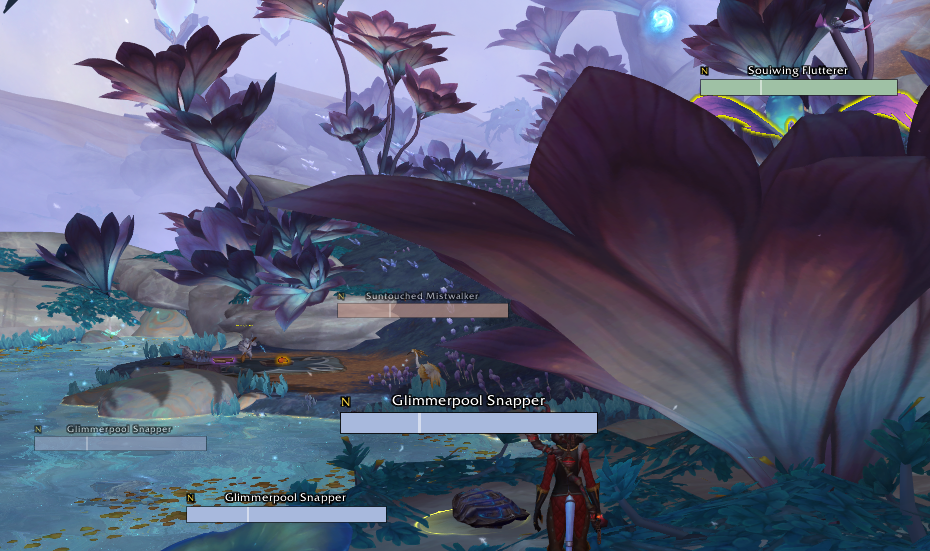
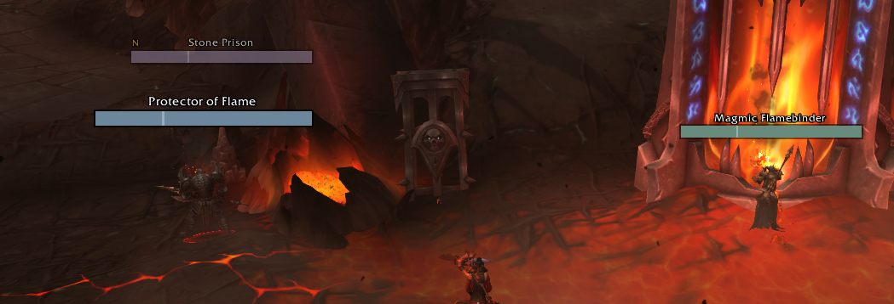

# Slab

Slab is a slim and colorful nameplate addon for Retail World of Warcraft that assigns each enemy a color for rapid recognition during combat.

**Status:** Experimental. I'm currently actively building & tweaking. Some ideas (like coloration) may change or be removed entirely.

### Features

- Built-in support for threat and tank pets.
- Built-in cast bars with support for cast targets.
- Compatible with existing nameplate WAs.
- Option-free. Install & go, no fiddling allowed.

### A Note on CVars and Plater

Many aspects of nameplates in WoW are controlled by CVars, which are stored as part of your game configuration independently of any addon. If you've used Plater, you likely have a large number of CVars set from adjusting nameplate settings through the Plater options.

Slab sets a single CVar for the purposes of avoiding jittery frames: `NamePlateMinScale`. There are a few that you may want to reset using `AdvancedInterfaceOptions` when trying Slab:

- `NamePlateMinAlpha`
- `NamePlateMinAlphaDistance`
- `NamePlateMinScaleDistance`
- `NamePlateMaxScale`
- `NamePlateMaxScaleDistance`

## Colorful

*tl;dr*

- **Hue:** what enemy this is
- **Saturation:** what your threat status on this enemy is
- **Lightness:** *fixed constant*

### Hue Algorithm

Nameplate colors are assigned using an algorithm that I stole in large part from the `rainbow-identifiers.el` Emacs package. First, the unit ID is converted to an angle in CIELAB color space. That is then combined with the lightness and saturation to produce a point in color space, which is then mapped to sRGB and applied to the nameplate.

## Efficient

Slab was written with efficiency in mind. Benchmarks are a WIP but there's no impact on framerate during Anduin intermissions, unlike my previous setup with Plater.

### Details

Each frame used by Slab registers only the minimal events required for its functionality. Expensive tools like `OnUpdate` are not used. The most expensive operation (by far) is calculating the SHA of a unit's name, which is done once per name per login (and something I'm looking at replacing with a quicker operation like B64).

## Tank Stuff

Threat is handled by default in two ways:

1. Threat status is indicated by modifying the saturation of a nameplate's color. In practice, this ends up being high-vis during combat. If you're used to the standard colors:
    - **Green:** 1x Saturation. You or another tank player are both current target and highest threat on the enemy
    - **Yellow:** 3x Saturation. The current target is a tank, but does not have the highest threat.
    - **Red:** 6x Saturation. The current target is not a tank. 
2. Tank pets like Black Ox Statue, Treants, and Earth Elemental are handled natively. An enemy being tanked by a pet shows the "PET" status in the top left.

# License

Copyright 2022 emallson. Published under the BSD 3-Clause.

There are small snippets of code cribbed in whole or part from Plater and KuiNameplates, which do not have a license listed. These bits are commented as such in the code.