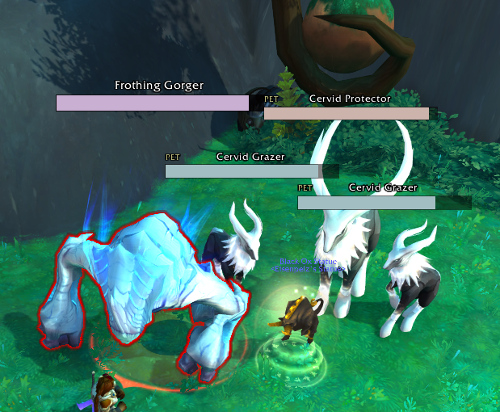

# Slab

Slab is a slim and colorful nameplate addon for Retail World of Warcraft that assigns each enemy a consistent color during combat, allowing them to be easily distinguished at a glance.

**Status:** Actively tweaking. Main functionality is set.

### Features

- Built-in support for threat and tank pets.
- Built-in cast bars with support for cast targets.
- Compatible with (most) existing nameplate WAs.
- Option-free. Install & go, no fiddling allowed.

### A Note on CVars and Plater

Many aspects of nameplates in WoW are controlled by CVars, which are stored as part of your game configuration independently of any addon. If you've used Plater, you likely have a large number of CVars set from adjusting nameplate settings through the Plater options.

Slab resets the following CVars to their default values:

- `NamePlateMinAlpha`
- `NamePlateMinAlphaDistance`
- `NamePlateMinScale`
- `NamePlateMinScaleDistance`
- `NamePlateMaxScale`
- `NamePlateMaxScaleDistance`

## Colors

*tl;dr*

- **Hue:** what enemy this is
- **Saturation:** what your threat status on this enemy is
- **Lightness:** *fixed constant*

<!--  -->

### Hue Algorithm

*tl;dr* - The game's internal NPC ID is used to pick from 17 colors. This means that each type of enemy gets one color assigned to it permanently. There is an 18th color reserved for special enemies like Explosive Orbs.

## Efficient

Slab was written with efficiency in mind. Any frame drops in-game are dealt with ruthlessly---I will cut features if it means maintaining a seemless high framerate in-game.

## Tank Stuff

Threat is handled by default in two ways:

1. Threat status is indicated by modifying the saturation of a nameplate's color. In practice, this ends up being high-vis during combat. If you're used to the standard colors:
    - **Green:** 1x Saturation. You or another tank player are both current target and highest threat on the enemy
    - **Yellow:** 3x Saturation. The current target is a tank, but does not have the highest threat.
    - **Red:** 6x Saturation. The current target is not a tank. 
2. Tank pets like Black Ox Statue, Treants, and Earth Elemental are handled natively. An enemy being tanked by a pet shows the "PET" status in the top left.

# License

Copyright 2022 emallson. Published under the BSD 3-Clause.

There are small snippets of code cribbed in whole or part from Plater and KuiNameplates, which do not have a license listed. These bits are commented as such in the code.
